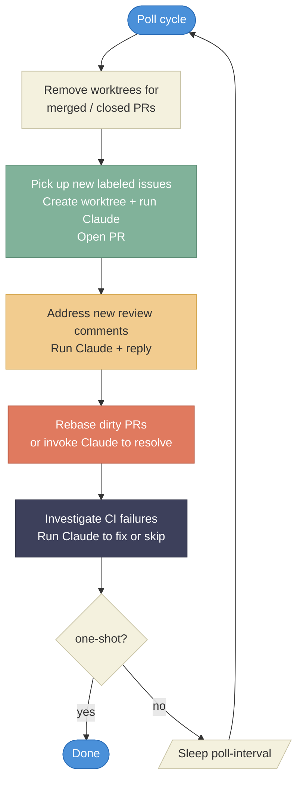

# github-issue-resolver

A single long-running Go binary that automatically resolves GitHub issues using Claude AI. It polls for issues with a configurable label, invokes Claude Code in headless mode to implement fixes, and opens pull requests — no webhooks or per-issue goroutines required.

## How it works

1. **Poll** — watches for open issues tagged with a label (default `good-for-ai`).
2. **Implement** — creates a git worktree, runs Claude Code (`claude -p`) to produce a fix.
3. **Open PR** — pushes the branch and creates a pull request linked to the issue.
4. **Address reviews** — picks up reviewer comments, runs Claude again to iterate.
5. **Rebase conflicts** — detects PRs with merge conflicts, attempts an automatic rebase, and falls back to Claude if that fails.
6. **Handle CI failures** — detects CI failures and asks Claude to fix them.

Claude never merges; a human must approve and merge every PR.

## Loop flow



## Prerequisites

- Go 1.25+
- [Claude Code CLI](https://docs.anthropic.com/en/docs/claude-code) installed and on `PATH`
- Google Cloud Application Default Credentials configured (`gcloud auth application-default login` or a service account key)
- A GitHub personal access token with repo scope

## Build

```bash
go build -o ai-agent ./cmd/ai-agent
```

## Usage

```bash
export GITHUB_TOKEN="ghp_..."
export CLOUD_ML_REGION="us-east5"
export ANTHROPIC_VERTEX_PROJECT_ID="my-gcp-project"

./ai-agent --owner myorg --repo myrepo
```

### Flags and environment variables

| Flag | Env var | Default | Description |
|------|---------|---------|-------------|
| `--owner` | `AI_AGENT_OWNER` | `openperouter` | GitHub repo owner |
| `--repo` | `AI_AGENT_REPO` | `openperouter` | GitHub repo name |
| `--label` | `AI_AGENT_LABEL` | `good-for-ai` | Issue label to watch |
| `--clone-dir` | `AI_AGENT_CLONE_DIR` | `~/ai-agent-work` | Working directory for clones and worktrees |
| `--poll-interval` | `AI_AGENT_POLL_INTERVAL` | `2m` | How often to poll GitHub |
| `--log-level` | `AI_AGENT_LOG_LEVEL` | `info` | Log level (`debug`, `info`, `warn`, `error`) |
| `--log-file` | `AI_AGENT_LOG_FILE` | stderr | Write logs to a file instead of stderr |
| `--signed-off-by` | `AI_AGENT_SIGNED_OFF_BY` | auto-detected | `Signed-off-by` line for commits |
| `--reviewers` | `AI_AGENT_REVIEWERS` | all | Comma-separated allowlist of reviewers to respond to |
| `--dry-run` | — | `false` | Log actions without executing them |
| `--one-shot` | — | `false` | Run one poll cycle and exit |
| — | `GITHUB_TOKEN` | *required* | GitHub personal access token |
| `--vertex-region` | `CLOUD_ML_REGION` | *required* | GCP Vertex AI region |
| `--vertex-project` | `ANTHROPIC_VERTEX_PROJECT_ID` | *required* | GCP project ID for Vertex AI |

## State

The agent is stateless on disk. On every startup it rebuilds its state from GitHub by scanning labeled issues and matching PRs, so there is nothing to back up or migrate.

## Testing

```bash
go test ./...
```

All external interactions (GitHub API, Claude CLI, git) are behind interfaces with mock implementations, so tests run without any credentials or network access.

## Project layout

```
cmd/ai-agent/       CLI entry point
pkg/agent/          Core logic (loop, state, GitHub client, Claude runner, worktree, prompts)
specs/              Design specifications for each component
```

## Safety

- Claude only creates PRs — it never merges.
- No force-pushes.
- On failure, the issue is labeled `ai-failed` with a comment explaining the error. A human removes the label and re-adds `good-for-ai` to retry.
- Billing is controlled through GCP IAM on the Vertex AI project.
